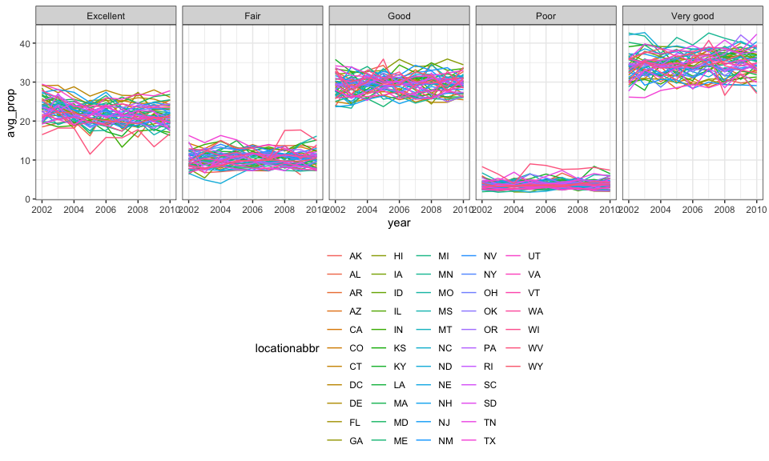
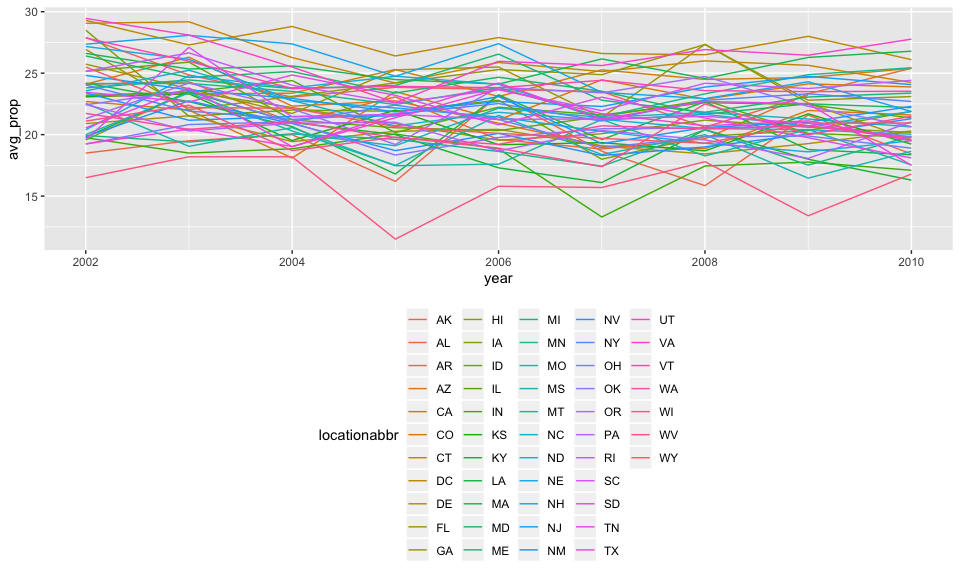
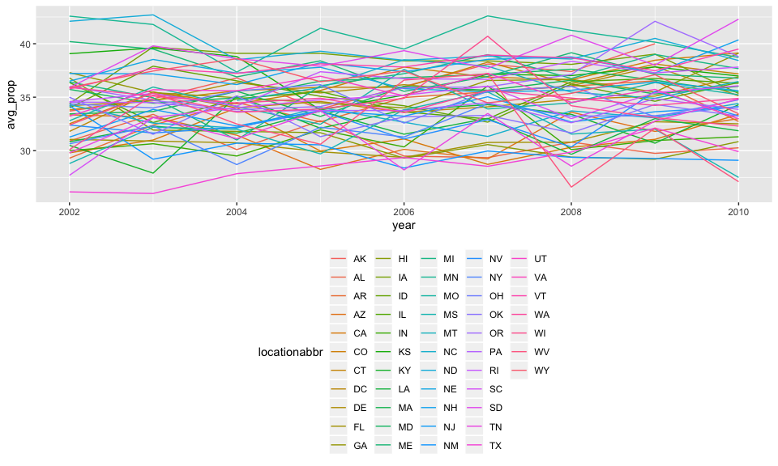
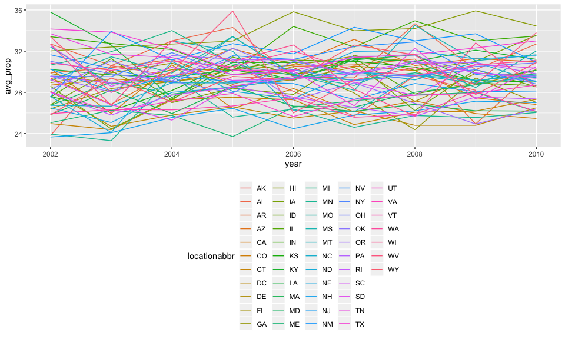
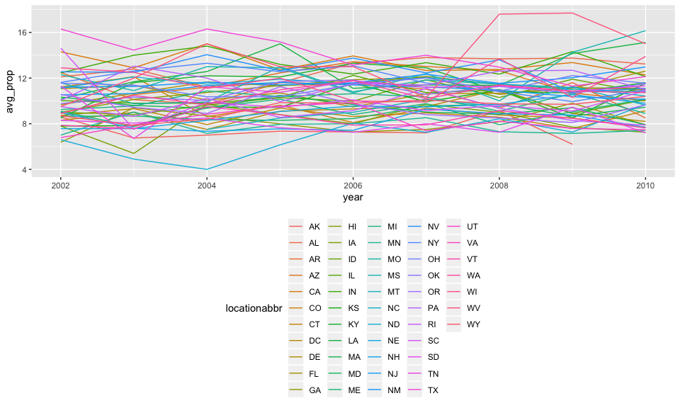
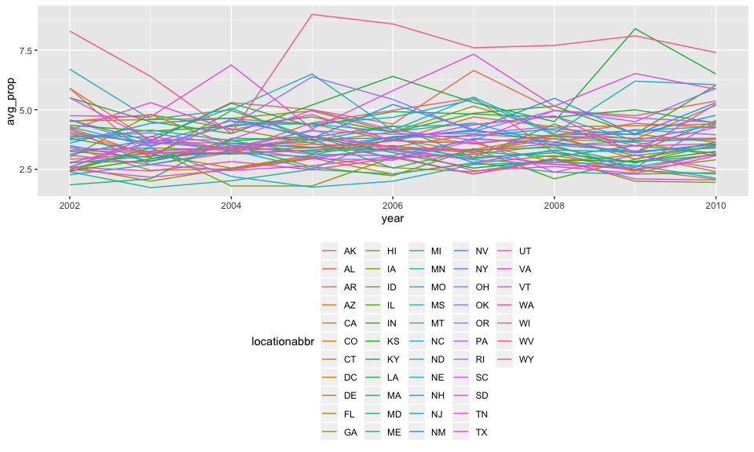

p8105\_hw3\_hx2263
================
Tiffany Xi
10/5/2018

Problem 1
=========

Load the `BRFSS` data from the p8105.datasets package

``` r
devtools::install_github("p8105/p8105.datasets")
library(p8105.datasets)
```

Data cleaning

``` r
brfss = brfss_smart2010 %>% 
  janitor::clean_names() %>% 
  filter(topic == "Overall Health") %>% 
  #select(-class, -topic, -question, -sample_size, -(confidence_limit_low:geo_location)) %>% 
  filter(response == "Excellent"| response == "Very good"| response == "Good"| response == "Fair"| response == "Poor") %>% 
  mutate(response = as.factor(response))
```

Using this dataset, answer the question

1.In 2002, which states were observed at 7 locations?

``` r
brfss %>% 
  filter(year == 2002) %>% 
  distinct(locationdesc, .keep_all = TRUE) %>% 
  count(locationabbr) %>% 
  filter(n == 7)
```

    ## # A tibble: 3 x 2
    ##   locationabbr     n
    ##   <chr>        <int>
    ## 1 CT               7
    ## 2 FL               7
    ## 3 NC               7

In 2002, the states which were observed at 7 locations are CT, FL, NC.

2.Make a “spaghetti plot” that shows the number of observations in each state from 2002 to 2010.

``` r
brfss %>% 
  distinct(year, locationdesc, .keep_all = TRUE) %>% 
  filter(year > 2001 & year < 2011) %>% 
  group_by(year, locationabbr) %>% 
  summarize(number = n()) %>% 
  ggplot(aes(x = year, y = number, color = locationabbr)) +
  geom_point(size = .5, alpha = .5) +
  geom_line(alpha = .6) +
  scale_x_continuous(breaks = c(2002, 2003, 2004, 2005, 2006, 
                                2007, 2008, 2009, 2010), 
                     labels = c("2002", "2003", "2004", "2005", "2006", 
                                "2007", "2008", "2009", "2010")) +
  theme_bw()
```


3.Make a table showing, for the years 2002, 2006, and 2010, the mean and standard deviation of the proportion of “Excellent” responses across locations in NY State.

``` r
brfss %>% 
  filter(locationabbr == "NY" & (year == 2002 | year == 2006 | year == 2010) & response == "Excellent") %>% 
  group_by(year) %>% 
  summarize(mean_excellent_prop = mean(data_value, na.rm = TRUE),
            sd_excellent_prop = sd(data_value, na.rm = TRUE)) %>% 
  knitr::kable(digits = 1)
```

|  year|  mean\_excellent\_prop|  sd\_excellent\_prop|
|-----:|----------------------:|--------------------:|
|  2002|                   24.0|                  4.5|
|  2006|                   22.5|                  4.0|
|  2010|                   22.7|                  3.6|

4.For each year and state, compute the average proportion in each response category (taking the average across locations in a state).

``` r
avg_prop_rep = brfss %>% 
  group_by(year, locationabbr, response) %>% 
  summarize(avg_prop = round(mean(data_value, na.rm = TRUE), digits = 2))
```

Make a five-panel plot that shows, for each response category separately, the distribution of these state-level averages over time.

``` r
ggplot(data = avg_prop_rep, aes(x = year, y = avg_prop, color = locationabbr)) +
    facet_grid( ~ response) +
    geom_line() +
    theme_bw() +
    theme(legend.position = "bottom")
```



``` r
excel_rep = avg_prop_rep %>% filter(response == "Excellent")
vg_rep = avg_prop_rep %>% filter(response == "Very good")
good_rep = avg_prop_rep %>% filter(response == "Good")
fair_rep = avg_prop_rep %>% filter(response == "Fair")
poor_rep = avg_prop_rep %>% filter(response == "Poor")

panel_plot = function(df){
  ggplot(data = df, aes(x = year, y = avg_prop, color = locationabbr)) +
    geom_line() +
    theme(legend.position = "bottom")
}

panel_plot(excel_rep)
```



``` r
panel_plot(vg_rep)
```



``` r
panel_plot(good_rep)
```



``` r
panel_plot(fair_rep)
```



``` r
panel_plot(poor_rep)  
```



``` r
ggplot(data = avg_prop_rep, aes(x = year, y = avg_prop, color = locationabbr)) +
    facet_grid( ~ response) +
    geom_point(alpha = .5) +
    geom_smooth(se = FALSE) +
    theme_bw() +
    theme(legend.position = "bottom")
```

    ## `geom_smooth()` using method = 'loess' and formula 'y ~ x'


