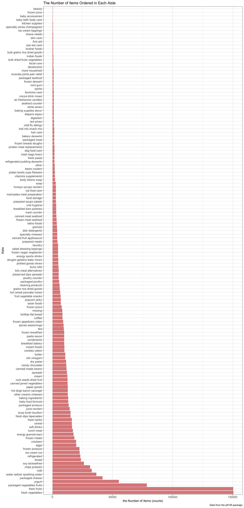
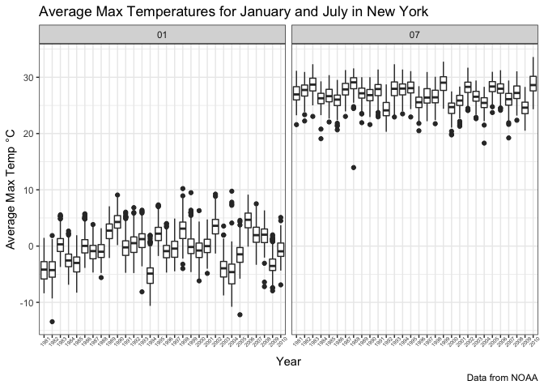

p8105\_hw3\_hx2263
================
Tiffany Xi
10/5/2018

(commenting on the results of each)(commenting on the results of each)(commenting on the results of each)(commenting on the results of each)(commenting on the results of each)(commenting on the results of each)(commenting on the results of each)(commenting on the results of each)(commenting on the results of each)(commenting on the results of each)(commenting on the results of each)(commenting on the results of each)(commenting on the results of each)(commenting on the results of each)(commenting on the results of each)(commenting on the results of each)(commenting on the results of each)(commenting on the results of each)(commenting on the results of each)(commenting on the results of each)(commenting on the results of each)(commenting on the results of each)(commenting on the results of each)(commenting on the results of each)(commenting on the results of each)(commenting on the results of each)

Problem 1
=========

### Load the `BRFSS` data from the p8105.datasets package.

``` r
brfss = p8105.datasets::brfss_smart2010
```

### Data cleaning

``` r
brfss_tidy = brfss %>% 
  janitor::clean_names() %>% 
  filter(topic == "Overall Health") %>% 
  rename(state = locationabbr, location = locationdesc) %>%
  filter(response %in% c("Excellent", "Very good", "Good", "Fair", "Poor")) %>% 
  mutate(response = factor(response, levels = c("Excellent", "Very good", "Good", "Fair", "Poor")))
```

### Answers

1.In 2002, which states were observed at 7 locations?

``` r
brfss_tidy %>% 
  filter(year == 2002) %>% 
  distinct(location, .keep_all = TRUE) %>% 
  count(state) %>% 
  filter(n == 7)
```

    ## # A tibble: 3 x 2
    ##   state     n
    ##   <chr> <int>
    ## 1 CT        7
    ## 2 FL        7
    ## 3 NC        7

In 2002, the states which were observed at 7 locations are CT (Connecticut), FL (Florida), NC (North Carolina) CT, FL, NC.

**Comment** Three states were observed exatly at 7 locations in 2002, what a coincidence!

2.Make a "spaghetti plot" that shows the number of observations in each state from 2002 to 2010.

``` r
spaghetti = brfss_tidy %>% 
  distinct(year, location, .keep_all = TRUE) %>% 
  group_by(year, state) %>%
  filter(year > 2001 & year < 2011) %>% 
  summarize(sum_loco = n()) 

ggplot(data = spaghetti, aes(x = year, y = sum_loco, color = state)) +
  geom_line(alpha = .7) +
  geom_text(data = filter(spaghetti, state == "FL"),
            aes(label = state), show.legend = F) +
  labs(
    title = "Number of Observations in Each State (2002~2010)", 
    x = "Year", 
    y = "Number of Observations", 
    legend = "State"
  ) +
  scale_x_continuous(breaks = c(2002, 2003, 2004, 2005, 2006, 
                                2007, 2008, 2009, 2010), 
                     labels = c("2002", "2003", "2004", "2005", "2006", 
                                "2007", "2008", "2009", "2010"))+
  theme_bw()
```


**Comment**: As is obsivously shown in the spaghetti plot above, (Florida) had its largest number of observations in 2007 and 2010, all over 40, much larger than any other states in that given year. The observation number of most states was less than 10 in this time period, and keep fluctuting as year changed.

3.Make a table showing, for the years 2002, 2006, and 2010, the mean and standard deviation of the proportion of “Excellent” responses across locations in NY State.

``` r
brfss_tidy %>% 
  filter(state == "NY" & year %in% c(2002, 2006, 2010) & response == "Excellent") %>% 
  group_by(year) %>% 
  summarize(mean_excel_prop = mean(data_value, na.rm = TRUE),
            sd_excel_prop = sd(data_value, na.rm = TRUE)) %>% 
  knitr::kable(digits = 1)
```

|  year|  mean\_excel\_prop|  sd\_excel\_prop|
|-----:|------------------:|----------------:|
|  2002|               24.0|              4.5|
|  2006|               22.5|              4.0|
|  2010|               22.7|              3.6|

**Comment**: As can be seen from the table above, the mean of the proportion of “Excellent” responses across locations in NY State in 2002 is higher than that of 2006 and 2010, which means the overall health condition was better in 2002 than in 2006 and the condition change positively in 2010. The standard deviation ranking of the proportion of “Excellent” responses across locations in NY State in 2002 &gt; 2006 &gt; 2010, indicating that the variability of proportion of “Excellent” responses in 2002 is the highest, and lowest in 2010.

4.For each year and state, compute the average proportion in each response category (taking the average across locations in a state).

``` r
avg_prop_rep = brfss_tidy %>% 
  group_by(year, state, response) %>% 
  summarize(avg_prop = round(mean(data_value, na.rm = TRUE), digits = 2))
avg_prop_rep
```

    ## # A tibble: 2,215 x 4
    ## # Groups:   year, state [?]
    ##     year state response  avg_prop
    ##    <int> <chr> <fct>        <dbl>
    ##  1  2002 AK    Excellent     27.9
    ##  2  2002 AK    Very good     33.7
    ##  3  2002 AK    Good          23.8
    ##  4  2002 AK    Fair           8.6
    ##  5  2002 AK    Poor           5.9
    ##  6  2002 AL    Excellent     18.5
    ##  7  2002 AL    Very good     30.9
    ##  8  2002 AL    Good          32.7
    ##  9  2002 AL    Fair          12.1
    ## 10  2002 AL    Poor           5.9
    ## # ... with 2,205 more rows

Make a five-panel plot that shows, for each response category separately, the distribution of these state-level averages over time.

``` r
avg_prop_rep %>% 
  ggplot(aes(x = year, y = avg_prop, color = state)) +
  facet_grid( ~ response) +
  geom_line() +
  labs(
    y = "Average propotion",
    x = "Year",
    title = "Distribution of State-level Response Averages Over Time",
    caption = "Data from the p8105.datasets package"
  ) +
  theme_bw() +
  theme(legend.position = "none")
```


**Comment**:

It is obvious that "Very good" response takes largest percent of all response, while "Poor" response accounts for lowest percentage of five response. The proportion ranking are like: "Very good" &gt; "Good" &gt; "Excellent" &gt; "Fair" &gt; "Poor". So, the overall health of citizens in selected counties is good in the time period of 2002~2010.

The proportion data of every state are kind of centralizated in a centrain value, which means that the overall health condition in each states differs in a small extent.

The fluctuation across year of response "Poor" is relatively small compared with other four responses.

``` r
excel_rep = avg_prop_rep %>% filter(response == "Excellent")
vg_rep = avg_prop_rep %>% filter(response == "Very good")
good_rep = avg_prop_rep %>% filter(response == "Good")
fair_rep = avg_prop_rep %>% filter(response == "Fair")
poor_rep = avg_prop_rep %>% filter(response == "Poor")

panel_plot = function(df){
  ggplot(data = df, aes(x = year, y = avg_prop, color = state)) +
    geom_line() +
    theme(legend.position = "bottom")
}

panel_plot(excel_rep)/panel_plot(vg_rep)/panel_plot(good_rep)/panel_plot(fair_rep)/panel_plot(poor_rep)
```


Problem 2
=========

### Load the `instacart` data from the p8105.datasets package and take a look.

``` r
instacart = p8105.datasets::instacart
head(instacart)
```

    ## # A tibble: 6 x 15
    ##   order_id product_id add_to_cart_ord… reordered user_id eval_set
    ##      <int>      <int>            <int>     <int>   <int> <chr>   
    ## 1        1      49302                1         1  112108 train   
    ## 2        1      11109                2         1  112108 train   
    ## 3        1      10246                3         0  112108 train   
    ## 4        1      49683                4         0  112108 train   
    ## 5        1      43633                5         1  112108 train   
    ## 6        1      13176                6         0  112108 train   
    ## # ... with 9 more variables: order_number <int>, order_dow <int>,
    ## #   order_hour_of_day <int>, days_since_prior_order <int>,
    ## #   product_name <chr>, aisle_id <int>, department_id <int>, aisle <chr>,
    ## #   department <chr>

``` r
instacart %>% 
  count(department)
```

    ## # A tibble: 21 x 2
    ##    department           n
    ##    <chr>            <int>
    ##  1 alcohol           5598
    ##  2 babies           14941
    ##  3 bakery           48394
    ##  4 beverages       114046
    ##  5 breakfast        29500
    ##  6 bulk              1359
    ##  7 canned goods     46799
    ##  8 dairy eggs      217051
    ##  9 deli             44291
    ## 10 dry goods pasta  38713
    ## # ... with 11 more rows

``` r
instacart %>% 
  count(aisle)
```

    ## # A tibble: 134 x 2
    ##    aisle                      n
    ##    <chr>                  <int>
    ##  1 air fresheners candles  1067
    ##  2 asian foods             7007
    ##  3 baby accessories         306
    ##  4 baby bath body care      328
    ##  5 baby food formula      13198
    ##  6 bakery desserts         1501
    ##  7 baking ingredients     13088
    ##  8 baking supplies decor   1094
    ##  9 beauty                   287
    ## 10 beers coolers           1839
    ## # ... with 124 more rows

### Description

The `instacart` dataset has 15 columns and 1384617 rows, which means it contains 1384617 observations and 15 variables. Each row in the dataset is a product information from an order. The structure of this dataset is *Tabular Data*. As far as I am concerned, this dataset describes the orders and reorder detail from customer `user_id` though Instacart app.

The key variables are `order_id`, `product_id` and `product_name`. We can see the user `user_id` bought `product_id` which is `product_name` belonging to `department` and located in `aisle`. We can also know how frequent one customer use this app to do grocery shopping according to `days_since_prior_order` and `order_number`.

For example,

|  order\_id|  product\_id|  add\_to\_cart\_order|  reordered|  user\_id| eval\_set |  order\_number|  order\_dow|  order\_hour\_of\_day|  days\_since\_prior\_order| product\_name    |  aisle\_id|  department\_id| aisle  | department |
|----------:|------------:|---------------------:|----------:|---------:|:----------|--------------:|-----------:|---------------------:|--------------------------:|:-----------------|----------:|---------------:|:-------|:-----------|
|          1|        49302|                     1|          1|    112108| train     |              4|           4|                    10|                          9| Bulgarian Yogurt |        120|              16| yogurt | dairy eggs |

the `user_id`1 made `order_id`1187899. He/she bought 11 items in `order_number`11 `days_since_prior_order`14 days after his/her last shopping, among which the `add_to_cart_order`9 was the first time order, other 10 items were reorders. `product_id`196 is Soda in `aisle`soft drinks `aisle_id`77 in `department`beverages which id is 7.

### Answers

1.How many aisles are there, and which aisles are the most items ordered from?

There are 134 aisles.

fresh fruits, fresh vegetables, packaged vegetables fruits aisle are the top 3 aisles which most items ordered from.

Among those, fresh vegetables aisle ranks first.

2.Make a plot that shows the number of items ordered in each aisle. Order aisles sensibly, and organize your plot so others can read it.

``` r
ggplot(data = instacart, aes(x = aisle)) +
  geom_bar(position = position_stack(reverse = TRUE)) +
  coord_flip() +
  labs(
      title = "The Number of Items Ordered in Each Aisle",
      y = "the Number of Items (counts)",
      x = "Aisle",
      caption = "Data from the p8105.package"
    ) +
  theme_bw()
```



3.Make a table showing the most popular item aisles "baking ingredients", "dog food care", and "packaged vegetables fruits"

``` r
instacart %>% 
  filter(aisle == "baking ingredients"| aisle == "dog food care"| aisle == "packaged vegetables fruits") %>% 
  group_by(aisle) %>% 
  count(product_name) %>% 
  mutate(item_ranking = min_rank(desc(n))) %>% 
  filter(item_ranking < 2) %>% 
  knitr::kable()
```

| aisle                      | product\_name                                 |     n|  item\_ranking|
|:---------------------------|:----------------------------------------------|-----:|--------------:|
| baking ingredients         | Light Brown Sugar                             |   499|              1|
| dog food care              | Snack Sticks Chicken & Rice Recipe Dog Treats |    30|              1|
| packaged vegetables fruits | Organic Baby Spinach                          |  9784|              1|

4.Make a table showing the mean hour of the day at which Pink Lady Apples and Coffee Ice Cream are ordered on each day of the week; format this table for human readers (i.e. produce a 2 x 7 table).

``` r
instacart %>% 
  filter(product_name == "Pink Lady Apples"| product_name == "Coffee Ice Cream" ) %>% 
  group_by(product_name, order_dow) %>% 
  summarise(mean_hour = mean(order_hour_of_day)) %>% 
  spread(key = order_dow, value = mean_hour) %>% 
  knitr::kable(digits = 2)
```

| product\_name    |      0|      1|      2|      3|      4|      5|      6|
|:-----------------|------:|------:|------:|------:|------:|------:|------:|
| Coffee Ice Cream |  13.77|  14.32|  15.38|  15.32|  15.22|  12.26|  13.83|
| Pink Lady Apples |  13.44|  11.36|  11.70|  14.25|  11.55|  12.78|  11.94|

Problem 3
=========

-   Load the `NY NOAA` data from the p8105.datasets package

``` r
noaa = p8105.datasets::ny_noaa
```

### Description

The `noaa` dataset has 7 columns and 2595176 rows, which means it contains 2595176 observations and 7 variables. The structure of this dataset is *Tabular Data*.

The key variables are `id`, `date`, `prcp`, `snow`, `snwd`, `tmax` and `tmin`. Each row in the dataset is a weather information including precipitation`prcp`, snowfall`snow`, snow depth`snwd`, maximum temperature`tmax` and min temperature`tmin` from one single weather station`id` in one day`date`. This dataset describes five core variables for all New York state weather stations from January 1, 1981 through December 31, 2010 according to 747 weather stations.

Missing values is a huge issue in this dataset, the number of missing number in five core variables are 145838, 381221, 591786, 1134358 and 1134420. Those are huge numbers and almost half of the whole rows doesn't have tmax and tmin.

### Answers

1.Do some data cleaning. Create separate variables for year, month, and day. Ensure observations for temperature, precipitation, and snowfall are given in reasonable units.

``` r
noaa_tidy = noaa %>% 
  separate(date, into = c("year", "month", "day"), sep = "-") %>% 
  mutate(pcrp_mm = ifelse(is.na(prcp), NA, prcp / 10),
         snow_mm = snow,
         tmax_ºC = ifelse(is.na(tmax), NA, as.integer(tmax)/ 10),
         tmin_ºC = ifelse(is.na(tmin), NA, as.integer(tmin)/ 10)) %>% 
  select(-prcp, -snow, -tmax, -tmin)
```

For snowfall, what are the most commonly observed values? Why?

``` r
noaa_tidy %>% 
  count(snow_mm) %>% 
  mutate(snow_ranking = min_rank(desc(n))) %>% 
  filter(snow_ranking < 2)
```

    ## # A tibble: 1 x 3
    ##   snow_mm       n snow_ranking
    ##     <int>   <int>        <int>
    ## 1       0 2008508            1

-   For snowfall, 0 are the most commonly observed values, because snow only happens in winter which is one over four seasons, so other seasons take up three fourth days. Also, only when temperature goes below zero can snow, which takes up a smaller percentage of New York State winter temp. So 0mm snowfall is the most commonly observed values.

2.Make a two-panel plot showing the average temperature in January and in July in each station across years. Is there any observable / interpretable structure? Any outliers?

``` r
noaa_tidy %>% 
  filter(month == "01" | month == "07") %>% 
  group_by(year, month) %>% 
  summarize(mean_tmax = mean(tmax_ºC, na.rm = TRUE)) %>% 
  ggplot(aes(x = year, y = mean_tmax, color = month)) +
  geom_point(size = 4)
```



``` r
noaa_tidy %>% 
  filter(month == "01" | month == "07") %>% 
  group_by(year, month) %>% 
  summarize(mean_tmin = mean(tmin_ºC, na.rm = TRUE)) %>% 
  ggplot(aes(x = year, y = mean_tmin, color = month)) +
  geom_point(size = 4)
```


3.Make a two-panel plot showing (i) tmax vs tmin for the full dataset (note that a scatterplot may not be the best option); (ii) make a plot showing the distribution of snowfall values greater than 0 and less than 100 separately by year.

``` r
ggplot(data = noaa_tidy, aes(x = year, y = tmax_ºC)) +
  geom_point()
```

    ## Warning: Removed 1134358 rows containing missing values (geom_point).


``` r
snow_year = noaa_tidy %>% 
  filter(snow_mm > 0 & snow_mm < 100) %>% 
  group_by(year, snow_mm)

#ggplot(data = snow_year, aes(x = mean(snow_mm, na.rm = TRUE))) +
  #geom_histogram()
```
