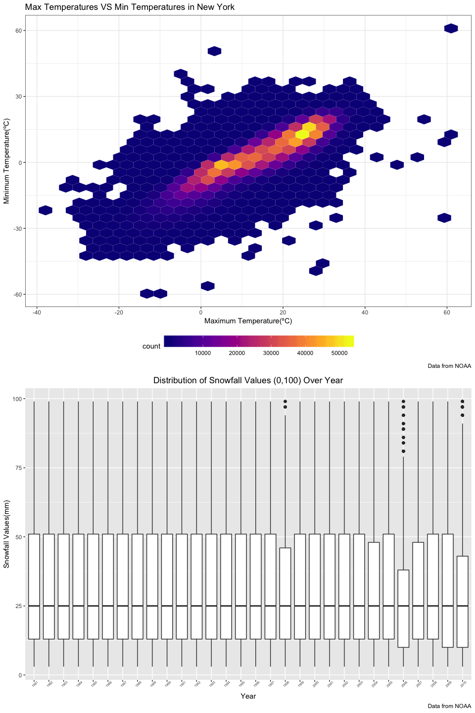

p8105\_hw3\_hx2263
================
Tiffany Xi
10/5/2018

Problem 1
=========

### Load the `BRFSS` data from the p8105.datasets package.

``` r
brfss = p8105.datasets::brfss_smart2010
```

### Data cleaning

``` r
brfss_tidy = brfss %>% 
  janitor::clean_names() %>% 
  filter(topic == "Overall Health") %>% 
  rename(state = locationabbr, location = locationdesc) %>%
  filter(response %in% c("Excellent", "Very good", "Good", "Fair", "Poor")) %>% 
  mutate(response = factor(response, levels = c("Excellent", "Very good", "Good", "Fair", "Poor")))
```

### Answers

1.In 2002, which states were observed at 7 locations?

``` r
brfss_tidy %>% 
  filter(year == 2002) %>% 
  distinct(location, .keep_all = TRUE) %>% 
  count(state) %>% 
  filter(n == 7)
```

    ## # A tibble: 3 x 2
    ##   state     n
    ##   <chr> <int>
    ## 1 CT        7
    ## 2 FL        7
    ## 3 NC        7

In 2002, the states which were observed at 7 locations are CT, FL, NC, which stands for Connecticut, Florida, North Carolina.

**Comment** Three states were observed exatly at 7 locations in 2002, what a coincidence!

2.Make a "spaghetti plot" that shows the number of observations in each state from 2002 to 2010.

``` r
spaghetti = brfss_tidy %>% 
  distinct(year, location, .keep_all = TRUE) %>% 
  group_by(year, state) %>%
  filter(year > 2001 & year < 2011) %>% 
  summarize(sum_loco = n()) 

ggplot(data = spaghetti, aes(x = year, y = sum_loco, color = state)) +
  geom_line(alpha = .7) +
  geom_text(data = filter(spaghetti, state == "FL"),
            aes(label = state), show.legend = F) +
  labs(
    title = "Number of Observations in Each State (2002~2010)", 
    x = "Year", 
    y = "Number of Observations", 
    legend = "State"
  ) +
  scale_x_continuous(breaks = c(2002, 2003, 2004, 2005, 2006, 
                                2007, 2008, 2009, 2010), 
                     labels = c("2002", "2003", "2004", "2005", "2006", 
                                "2007", "2008", "2009", "2010"))+
  theme_bw()
```


**Comment**: As is obsivously shown in the spaghetti plot above, (Florida) had its largest number of observations in 2007 and 2010, all over 40, much larger than any other states in that given year. The observation number of most states was less than 10 in this time period, and keep fluctuting as year changed.

3.Make a table showing, for the years 2002, 2006, and 2010, the mean and standard deviation of the proportion of “Excellent” responses across locations in NY State.

``` r
brfss_tidy %>% 
  filter(state == "NY" & year %in% c(2002, 2006, 2010) & response == "Excellent") %>% 
  group_by(year) %>% 
  summarize(mean_excel_prop = mean(data_value, na.rm = TRUE),
            sd_excel_prop = sd(data_value, na.rm = TRUE)) %>% 
  knitr::kable(digits = 1)
```

|  year|  mean\_excel\_prop|  sd\_excel\_prop|
|-----:|------------------:|----------------:|
|  2002|               24.0|              4.5|
|  2006|               22.5|              4.0|
|  2010|               22.7|              3.6|

**Comment**: As can be seen from the table above, the mean of the proportion of “Excellent” responses across locations in NY State in 2002 is higher than that of 2006 and 2010, which means the overall health condition was better in 2002 than in 2006 and the condition change positively in 2010. The standard deviation ranking of the proportion of “Excellent” responses across locations in NY State in 2002 &gt; 2006 &gt; 2010, indicating that the variability of proportion of “Excellent” responses in 2002 is the highest, and lowest in 2010.

4.For each year and state, compute the average proportion in each response category (taking the average across locations in a state).

``` r
avg_prop_rep = brfss_tidy %>% 
  group_by(year, state, response) %>% 
  summarize(avg_prop = round(mean(data_value, na.rm = TRUE), digits = 2))
avg_prop_rep
```

    ## # A tibble: 2,215 x 4
    ## # Groups:   year, state [?]
    ##     year state response  avg_prop
    ##    <int> <chr> <fct>        <dbl>
    ##  1  2002 AK    Excellent     27.9
    ##  2  2002 AK    Very good     33.7
    ##  3  2002 AK    Good          23.8
    ##  4  2002 AK    Fair           8.6
    ##  5  2002 AK    Poor           5.9
    ##  6  2002 AL    Excellent     18.5
    ##  7  2002 AL    Very good     30.9
    ##  8  2002 AL    Good          32.7
    ##  9  2002 AL    Fair          12.1
    ## 10  2002 AL    Poor           5.9
    ## # ... with 2,205 more rows

Make a five-panel plot that shows, for each response category separately, the distribution of these state-level averages over time.

``` r
avg_prop_rep %>% 
  ggplot(aes(x = year, y = avg_prop, color = state)) +
  facet_grid( ~ response, scales = "free_y") +
  geom_line() +
  labs(
    y = "Average propotion",
    x = "Year",
    title = "Distribution of State-level Response Averages Over Time",
    caption = "Data from the p8105.datasets package"
  ) +
  theme_bw() +
  theme(legend.position = "bottom")
```


**Comment**:

It is obvious that "Very good" response takes largest percent of all response, while "Poor" response accounts for lowest percentage of five response. The proportion ranking are like: "Very good" &gt; "Good" &gt; "Excellent" &gt; "Fair" &gt; "Poor". So, the overall health of citizens in selected counties is good in the time period of 2002~2010.

The proportion data of every state are kind of centralizated in a centrain value, which means that the overall health condition in each states differs in a small extent.

The fluctuation across year of response "Poor" is relatively small compared with other four responses.

Problem 2
=========

### Load the `instacart` data from the p8105.datasets package and take a look.

``` r
instacart = p8105.datasets::instacart
skimr::skim(instacart)
```

    ## Skim summary statistics
    ##  n obs: 1384617 
    ##  n variables: 15 
    ## 
    ## ── Variable type:character ────────────────────────────────────────────────────────────────────────────────
    ##      variable missing complete       n min max empty n_unique
    ##         aisle       0  1384617 1384617   3  29     0      134
    ##    department       0  1384617 1384617   4  15     0       21
    ##      eval_set       0  1384617 1384617   5   5     0        1
    ##  product_name       0  1384617 1384617   3 159     0    39123
    ## 
    ## ── Variable type:integer ──────────────────────────────────────────────────────────────────────────────────
    ##                variable missing complete       n       mean        sd p0
    ##       add_to_cart_order       0  1384617 1384617       8.76      7.42  1
    ##                aisle_id       0  1384617 1384617      71.3      38.1   1
    ##  days_since_prior_order       0  1384617 1384617      17.07     10.43  0
    ##           department_id       0  1384617 1384617       9.84      6.29  1
    ##               order_dow       0  1384617 1384617       2.7       2.17  0
    ##       order_hour_of_day       0  1384617 1384617      13.58      4.24  0
    ##                order_id       0  1384617 1384617 1706297.62 989732.65  1
    ##            order_number       0  1384617 1384617      17.09     16.61  4
    ##              product_id       0  1384617 1384617   25556.24  14121.27  1
    ##               reordered       0  1384617 1384617       0.6       0.49  0
    ##                 user_id       0  1384617 1384617   1e+05     59487.15  1
    ##     p25     p50     p75    p100     hist
    ##       3       7      12      80 ▇▃▁▁▁▁▁▁
    ##      31      83     107     134 ▃▇▃▃▇▅▅▆
    ##       7      15      30      30 ▂▅▃▃▁▂▁▇
    ##       4       8      16      21 ▃▇▂▁▂▆▁▃
    ##       1       3       5       6 ▇▅▃▃▁▃▅▅
    ##      10      14      17      23 ▁▁▃▇▇▇▅▂
    ##  843370 1701880 2568023 3421070 ▇▇▇▇▇▇▇▇
    ##       6      11      21     100 ▇▂▁▁▁▁▁▁
    ##   13380   25298   37940   49688 ▆▆▇▇▇▆▇▇
    ##       0       1       1       1 ▆▁▁▁▁▁▁▇
    ##   51732   1e+05  154959  206209 ▇▇▇▇▇▇▇▇

### Description

The `instacart` dataset has 15 columns and 1384617 rows, which means it contains 1384617 observations and 15 variables. Each row in the dataset is a product information from an order. The structure of this dataset is *Tabular Data*. As far as I am concerned, this dataset describes the orders and reorder detail from customer `user_id` though Instacart app.

The key variables are `order_id`, `product_id` and `product_name`. We can see the user `user_id` bought `product_id` which is `product_name` belonging to `department` and located in `aisle`. We can also know how frequent one customer use this app to do grocery shopping according to `days_since_prior_order` and `order_number`.

For example, the `user_id`1 made `order_id`1187899. He/she bought 11 items in `order_number`11 `days_since_prior_order`14 days after his/her last shopping, among which the `add_to_cart_order`9 was the first time order, other 10 items were reorders. `product_id`196 is Soda in `aisle`soft drinks `aisle_id`77 in `department`beverages which id is 7.

### Answers

1.How many aisles are there, and which aisles are the most items ordered from?

There are 134 aisles.

fresh fruits, fresh vegetables, packaged vegetables fruits aisle are the top 3 aisles which most items ordered from.

Among those, fresh vegetables aisle ranks first.

**Comment** Nowadays, people are really having a healthy lifestyle, which is pretty happy fact for us public health students to see. Fresh or packaged fruit and veges are the most important component of everyday grocery shopping.

2.Make a plot that shows the number of items ordered in each aisle. Order aisles sensibly, and organize your plot so others can read it.

``` r
instacart %>%
  group_by(aisle) %>%
  summarize(num = n()) %>%
  arrange(desc(num)) %>% 
  ggplot(aes(x = reorder(aisle, -num), y = num)) + 
    coord_flip() + 
    geom_bar(stat = "identity", fill = "#DD8888") +
    labs(
        title = "The Number of Items Ordered in Each Aisle",
        y = "the Number of Items (counts)",
        x = "Aisle",
        caption = "Data from the p8105.package"
      ) +
    theme_bw() +
    theme(axis.text = element_text(size = 10))
```


**Comment**:

As is clearly shown in the barplot above, the distribution of the number of items ordered in each aisle is highly skewed to food department. Among all the items, the top 8s are fresh vegetables, fresh fruits, packaged vegetables fruits, yogurt, packaged cheese, water seltzer sparkling water, milk, chips pretzels, which the number of items are greater than 30000.

The least 6 number of items comes from beauty, frozen juice, baby accessories, baby bath body care, kitchen supplies, specialty wines champagnes aisles, the underlying reasons could be people are not used to do shopping on app when it comes to baby product, beauty and wines. They may still prefer to speciality stores.

3.Make a table showing the most popular item in each of the aisles “baking ingredients”, “dog food care”, and “packaged vegetables fruits”.

``` r
instacart %>% 
  filter(aisle == "baking ingredients"| aisle == "dog food care"| aisle == "packaged vegetables fruits") %>% 
  group_by(aisle) %>% 
  count(product_name) %>% 
  mutate(item_ranking = min_rank(desc(n))) %>% 
  filter(item_ranking < 2) %>% 
  knitr::kable()
```

| aisle                      | product\_name                                 |     n|  item\_ranking|
|:---------------------------|:----------------------------------------------|-----:|--------------:|
| baking ingredients         | Light Brown Sugar                             |   499|              1|
| dog food care              | Snack Sticks Chicken & Rice Recipe Dog Treats |    30|              1|
| packaged vegetables fruits | Organic Baby Spinach                          |  9784|              1|

**Comment**: As we can see from the table above, the most popular item in "baking ingredients" is Light Brown Sugar, which had been ordered 499 times. In "dog food care" aisle, the most popular item is "Snack Sticks Chicken & Rice Recipe Dog Treats", which were ordered 30 times. The most popular item in "packaged vegetables fruits" aisle is Organic Baby Spinach, it has been ordered 9784 times. The merchant should look into the most popular items data carefully in each aisle and make special plan about the position it should be put to achieve maximum sales volume.

4.Make a table showing the mean hour of the day at which Pink Lady Apples and Coffee Ice Cream are ordered on each day of the week; format this table for human readers (i.e. produce a 2 x 7 table).

``` r
instacart %>% 
  filter(product_name == "Pink Lady Apples"| product_name == "Coffee Ice Cream" ) %>% 
  group_by(product_name, order_dow) %>% 
  summarise(mean_hour = mean(order_hour_of_day)) %>% 
  mutate(order_dow = ordered(order_dow, levels = c(0:6), 
                        labels = c("Sunday", "Monday", "Tuesday", "Wednesday", 
                                   "Thursday", "Friday", "Saturday"))) %>% 
  spread(key = order_dow, value = mean_hour) %>% 
  knitr::kable(digits = 1)
```

| product\_name    |  Sunday|  Monday|  Tuesday|  Wednesday|  Thursday|  Friday|  Saturday|
|:-----------------|-------:|-------:|--------:|----------:|---------:|-------:|---------:|
| Coffee Ice Cream |    13.8|    14.3|     15.4|       15.3|      15.2|    12.3|      13.8|
| Pink Lady Apples |    13.4|    11.4|     11.7|       14.2|      11.6|    12.8|      11.9|

**Comment**: From the table, we can make assumptions that people are tend to buy Coffee Ice Cream in the afternoon at about 1 pm, maybe as after-lunch dessert.However, on Tuesday, Wednsday and Thursday, the ordering time is after 3 pm, maybe people are too busy in weekdays to think about ice cream. Pink Lady Apples are usually ordered in the morning near noon at about 11 am, which is a bit earlier than Coffee Ice Cream, so people seem prefer having apples before lunch.

Problem 3
=========

-   Load the `NY NOAA` data from the p8105.datasets package

``` r
noaa = p8105.datasets::ny_noaa
```

### Description

The `noaa` dataset has 7 columns and 2595176 rows, which means it contains 2595176 observations and 7 variables. The structure of this dataset is *Tabular Data*.

The key variables are `id`, `date`, `prcp`, `snow`, `snwd`, `tmax` and `tmin`. Each row in the dataset is a weather information including precipitation`prcp`, snowfall`snow`, snow depth`snwd`, maximum temperature`tmax` and min temperature`tmin` from one single weather station`id` in one day`date`. This dataset describes five core variables for all New York state weather stations from January 1, 1981 through December 31, 2010 according to 747 weather stations.

Missing values is a huge issue in this dataset, the number of missing number in five core variables are 145838, 381221, 591786, 1134358 and 1134420. Those are huge numbers and percentages are 0.0561958, 0.146896, 0.2280331, 0.4371025 and 0.4371264, where almost half of the whole rows doesn't have tmax and tmin.

### Answers

1.Do some data cleaning. Create separate variables for year, month, and day. Ensure observations for temperature, precipitation, and snowfall are given in reasonable units.

``` r
noaa_tidy = noaa %>% 
  janitor::clean_names() %>% 
  separate(date, into = c("year", "month", "day"), sep = "-") %>% 
  mutate(pcrp_mm = ifelse(is.na(prcp), NA, prcp / 10),
         snow_mm = snow,
         tmax_ºC = ifelse(is.na(tmax), NA, as.integer(tmax)/ 10),
         tmin_ºC = ifelse(is.na(tmin), NA, as.integer(tmin)/ 10)) %>% 
  select(-prcp, -snow, -tmax, -tmin)
```

For snowfall, what are the most commonly observed values? Why?

``` r
noaa_tidy %>% 
  count(snow_mm) %>% 
  mutate(snow_ranking = min_rank(desc(n))) %>% 
  filter(snow_ranking < 2)
```

    ## # A tibble: 1 x 3
    ##   snow_mm       n snow_ranking
    ##     <int>   <int>        <int>
    ## 1       0 2008508            1

For snowfall, 0 mm are the most commonly observed values, which had been observed 2008508 times. Because snow only happens in winter which is one over four seasons, so other seasons take up three fourth days. Also, only when temperature goes below zero can snow, which takes up a smaller percentage of New York State winter temp. So 0mm snowfall is the most commonly observed values.

2.Make a two-panel plot showing the average max temperature in January and in July in each station across years. Is there any observable / interpretable structure? Any outliers?

``` r
noaa_tidy %>%
  filter(tmax_ºC != "NA" & (month == "01" | month == "07")) %>%
  group_by(id, month, year) %>%
  summarise(mean_temp = mean(tmax_ºC)) %>%
  ggplot(aes(x = year, y = mean_temp, group = year)) +
  geom_boxplot() +
  facet_grid( ~ month) +
  labs(
      x = "Year",
      y = "Average Max Temp °C",
      title = "Average Max Temperatures for January and July in New York",
      caption = "Data from NOAA"
    ) +
  theme_bw() +
  theme(axis.text.x = element_text(angle = 45, size = 5))
```


**Comment**:

From the two-panel plot above, we can easily observed that the average max temperature in July in each station across years is much higher than that in July, which make sense cause summer is hotter than winter.

The average temperture points of January is more spreadout than that in July, meaning that the temp has greater variation in winter than in summer. As for the outliers, we can see that in the Janurary of 1982, 1993 and 2005, there were extremely cold observations. In the July of 1988, there was an outlier of less than 15ºC.

But we don't see any strong tendency in climate change in last three decades, which may be a good thing cause there is no significant global warming effect at least in NY, NY.

3.Make a two-panel plot showing (i) tmax vs tmin for the full dataset (note that a scatterplot may not be the best option);

``` r
temp_plot = noaa_tidy %>% 
  filter(tmax_ºC != "NA" & tmin_ºC != "NA") %>% 
  ggplot(aes(x = tmax_ºC, y = tmin_ºC)) +
  geom_hex() +
  labs(
    y = "Minimum Temperature(ºC)", 
    x = "Maximum Temperature(ºC)",
    title = "Max Temperatures VS Min Temperatures in New York",
    caption = "Data from NOAA"
  ) +
  viridis::scale_fill_viridis(option = "plasma") +
  theme_bw() +
  theme(legend.position = "bottom", 
        legend.key.width = unit(0.8, "in"))
```

1.  make a plot showing the distribution of snowfall values greater than 0 and less than 100 separately by year.

``` r
snow_plot = noaa_tidy %>%
  filter(snow_mm >  0,  snow_mm < 100) %>%
  ggplot(aes(x = year, y = snow_mm, group = year)) +
  geom_boxplot() +
  labs(x = "Year", 
       y = "Snowfall Values(mm)",
       title = "Distribution of Snowfall Values (0,100) Over Year",
       caption = "Data from NOAA"
       ) +
  theme(plot.title = element_text(hjust = 0.5)) + 
  theme(axis.text.x = element_text(angle = 45, size = 5))

temp_plot/snow_plot
```



**Comment**:

(i)The temperture plot indicates that the minimum temperture are in positive propotion to maximum temperture, tmin increases with the climb of tmax. The light yellow hex represents the point of highest frequency where maximum temperture is about 25ºC and the minimum temperture is approximately 15ºC.

(ii)Snowfall distribution are all highly right skewed. The snowfall value is mainly concentrated between 10mm and 50mm and the median of snowfall values was quite stable and centered around 25mm. However, in 2006, the snowfall value was significantly lower than other years and had a lot of outliers. Snowfall distribution across different years in the last 30 years are quite identical to each other, so the snowfall is a relatively stable climate data.
