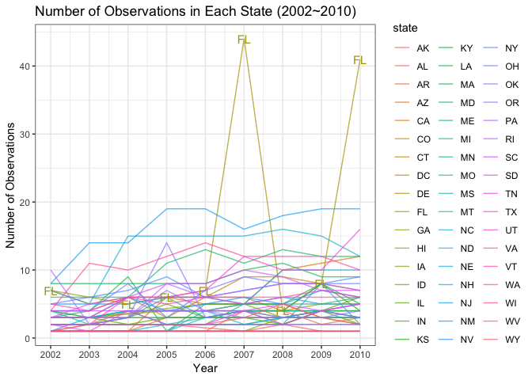

p8105\_hw3\_hx2263
================
Tiffany Xi
10/5/2018

Problem 1
=========

-   Load the `BRFSS` data from the p8105.datasets package.

``` r
devtools::install_github("p8105/p8105.datasets")
library(p8105.datasets)
```

-   Data cleaning

``` r
brfss = brfss_smart2010 %>% 
  janitor::clean_names() %>% 
  filter(topic == "Overall Health") %>% 
#select(-class, -topic, -question, -sample_size, -(confidence_limit_low:geo_location)) %>% 
  filter(response == "Excellent"| response == "Very good"| response == "Good"| response == "Fair"| response == "Poor") %>% 
  mutate(response = as.factor(response))
```

### Answers

1.In 2002, which states were observed at 7 locations?

``` r
brfss %>% 
  filter(year == 2002) %>% 
  distinct(locationdesc, .keep_all = TRUE) %>% 
  count(locationabbr) %>% 
  filter(n == 7)
```

    ## # A tibble: 3 x 2
    ##   locationabbr     n
    ##   <chr>        <int>
    ## 1 CT               7
    ## 2 FL               7
    ## 3 NC               7

In 2002, the states which were observed at 7 locations are CT, FL, NC.

2.Make a “spaghetti plot” that shows the number of observations in each state from 2002 to 2010.

``` r
brfss %>% 
  distinct(year, locationdesc, .keep_all = TRUE) %>% 
  filter(year > 2001 & year < 2011) %>% 
  group_by(year, locationabbr) %>% 
  summarize(number = n()) %>% 
  ggplot(aes(x = year, y = number, color = locationabbr)) +
  geom_point(size = .5, alpha = .5) +
  geom_line(alpha = .6) +
  scale_x_continuous(breaks = c(2002, 2003, 2004, 2005, 2006, 
                                2007, 2008, 2009, 2010), 
                     labels = c("2002", "2003", "2004", "2005", "2006", 
                                "2007", "2008", "2009", "2010")) +
  theme_bw()
```



3.Make a table showing, for the years 2002, 2006, and 2010, the mean and standard deviation of the proportion of “Excellent” responses across locations in NY State.

``` r
brfss %>% 
  filter(locationabbr == "NY" & (year == 2002 | year == 2006 | year == 2010) & response == "Excellent") %>% 
  group_by(year) %>% 
  summarize(mean_excellent_prop = mean(data_value, na.rm = TRUE),
            sd_excellent_prop = sd(data_value, na.rm = TRUE)) %>% 
  knitr::kable(digits = 1)
```

|  year|  mean\_excellent\_prop|  sd\_excellent\_prop|
|-----:|----------------------:|--------------------:|
|  2002|                   24.0|                  4.5|
|  2006|                   22.5|                  4.0|
|  2010|                   22.7|                  3.6|

4.For each year and state, compute the average proportion in each response category (taking the average across locations in a state).

``` r
avg_prop_rep = brfss %>% 
  group_by(year, locationabbr, response) %>% 
  summarize(avg_prop = round(mean(data_value, na.rm = TRUE), digits = 2))
```

Make a five-panel plot that shows, for each response category separately, the distribution of these state-level averages over time.

``` r
ggplot(data = avg_prop_rep, aes(x = year, y = avg_prop, color = locationabbr)) +
    facet_grid( ~ response) +
    geom_line() +
    theme_bw() +
    theme(legend.position = "bottom")
```


``` r
excel_rep = avg_prop_rep %>% filter(response == "Excellent")
vg_rep = avg_prop_rep %>% filter(response == "Very good")
good_rep = avg_prop_rep %>% filter(response == "Good")
fair_rep = avg_prop_rep %>% filter(response == "Fair")
poor_rep = avg_prop_rep %>% filter(response == "Poor")

panel_plot = function(df){
  ggplot(data = df, aes(x = year, y = avg_prop, color = locationabbr)) +
    geom_line() +
    theme(legend.position = "bottom")
}

panel_plot(excel_rep)
```


``` r
panel_plot(vg_rep)
```


``` r
panel_plot(good_rep)
```


``` r
panel_plot(fair_rep)
```


``` r
panel_plot(poor_rep)  
```


``` r
ggplot(data = avg_prop_rep, aes(x = year, y = avg_prop, color = locationabbr)) +
    facet_grid( ~ response) +
    geom_point(alpha = .5) +
    geom_smooth(se = FALSE) +
    theme_bw() +
    theme(legend.position = "bottom")
```

    ## `geom_smooth()` using method = 'loess' and formula 'y ~ x'


Problem 2
=========

-   Load the `instacart` data from the p8105.datasets package and take a look.

``` r
instacart = p8105.datasets::instacart
head(instacart)
```

    ## # A tibble: 6 x 15
    ##   order_id product_id add_to_cart_ord… reordered user_id eval_set
    ##      <int>      <int>            <int>     <int>   <int> <chr>   
    ## 1        1      49302                1         1  112108 train   
    ## 2        1      11109                2         1  112108 train   
    ## 3        1      10246                3         0  112108 train   
    ## 4        1      49683                4         0  112108 train   
    ## 5        1      43633                5         1  112108 train   
    ## 6        1      13176                6         0  112108 train   
    ## # ... with 9 more variables: order_number <int>, order_dow <int>,
    ## #   order_hour_of_day <int>, days_since_prior_order <int>,
    ## #   product_name <chr>, aisle_id <int>, department_id <int>, aisle <chr>,
    ## #   department <chr>

### Description

The `instacart` dataset has 15 columns and 1384617 rows, which means it contains 1384617 observations and 15 variables. Each row in the dataset is a product information from an order. The structure of this dataset is *Tabular Data*. As far as I am concerned, this dataset describes the orders and reorder detail from customer `user_id` though Instacart app.

The key variables are `order_id`, `product_id` and `product_name`. We can see the user `user_id` bought `product_id` which is `product_name` belonging to `department` and located in `aisle`. We can also know how frequent one customer use this app to do grocery shopping according to `days_since_prior_order` and `order_number`.

For example, the `user_id`1 made `order_id`1187899. He/she bought 11 items in `order_number`11 `days_since_prior_order`14 days after his/her last shopping, among which the `add_to_cart_order`9 was the first time order, other 10 items were reorders. `product_id`196 is Soda in `aisle`soft drinks `aisle_id`77 in `department`beverages which id is 7.

### Answers

1.How many aisles are there, and which aisles are the most items ordered from?

There are 134 aisles.

fresh fruits, fresh vegetables, packaged vegetables fruits aisle are the top 3 aisles which most items ordered from. Among those, fresh vegetables aisle ranks first.

2.Make a plot that shows the number of items ordered in each aisle. Order aisles sensibly, and organize your plot so others can read it.

``` r
ggplot(data = instacart, aes(x = aisle)) +
  geom_bar(position = position_stack(reverse = TRUE)) +
  coord_flip() +
  labs(
      title = "The Number of Items Ordered in Each Aisle",
      y = "the Number of Items (counts)",
      x = "Aisle",
      caption = "Data from the p8105.package"
    ) +
  theme_bw()
```


3.Make a table showing the most popular item aisles "baking ingredients", "dog food care", and "packaged vegetables fruits"

``` r
instacart %>% 
  filter(aisle == "baking ingredients"| aisle == "dog food care"| aisle == "packaged vegetables fruits") %>% 
  group_by(aisle) %>% 
  count(product_name) %>% 
  mutate(item_ranking = min_rank(desc(n))) %>% 
  filter(item_ranking < 2) %>% 
  knitr::kable()
```

| aisle                      | product\_name                                 |     n|  item\_ranking|
|:---------------------------|:----------------------------------------------|-----:|--------------:|
| baking ingredients         | Light Brown Sugar                             |   499|              1|
| dog food care              | Snack Sticks Chicken & Rice Recipe Dog Treats |    30|              1|
| packaged vegetables fruits | Organic Baby Spinach                          |  9784|              1|

4.Make a table showing the mean hour of the day at which Pink Lady Apples and Coffee Ice Cream are ordered on each day of the week; format this table for human readers (i.e. produce a 2 x 7 table).

``` r
instacart %>% 
  filter(product_name == "Pink Lady Apples"| product_name == "Coffee Ice Cream" ) %>% 
  group_by(product_name, order_dow) %>% 
  summarise(mean_hour = mean(order_hour_of_day)) %>% 
  spread(key = order_dow, value = mean_hour) %>% 
  knitr::kable(digits = 2)
```

| product\_name    |      0|      1|      2|      3|      4|      5|      6|
|:-----------------|------:|------:|------:|------:|------:|------:|------:|
| Coffee Ice Cream |  13.77|  14.32|  15.38|  15.32|  15.22|  12.26|  13.83|
| Pink Lady Apples |  13.44|  11.36|  11.70|  14.25|  11.55|  12.78|  11.94|
